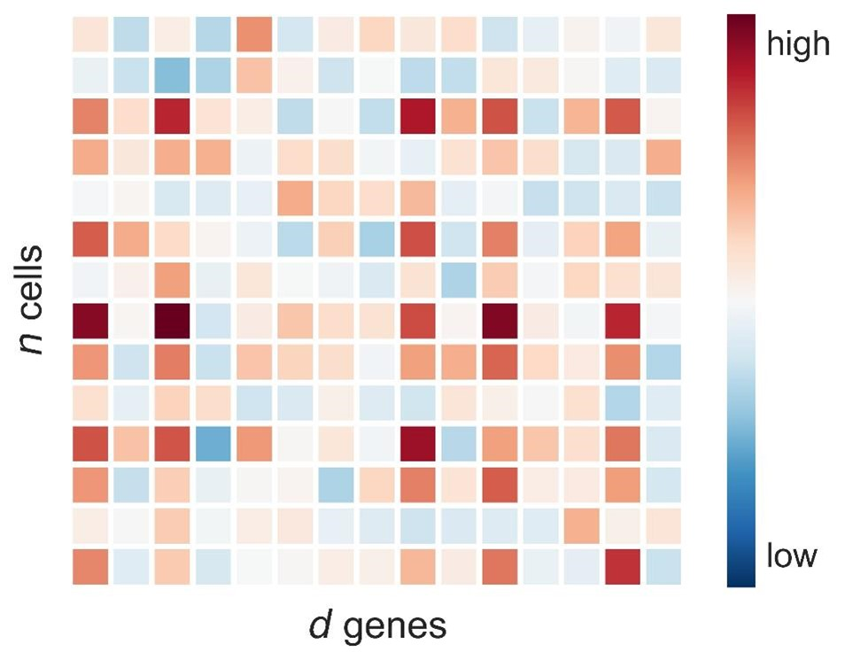
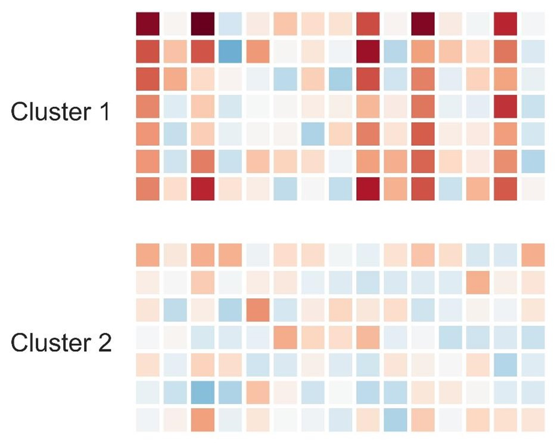
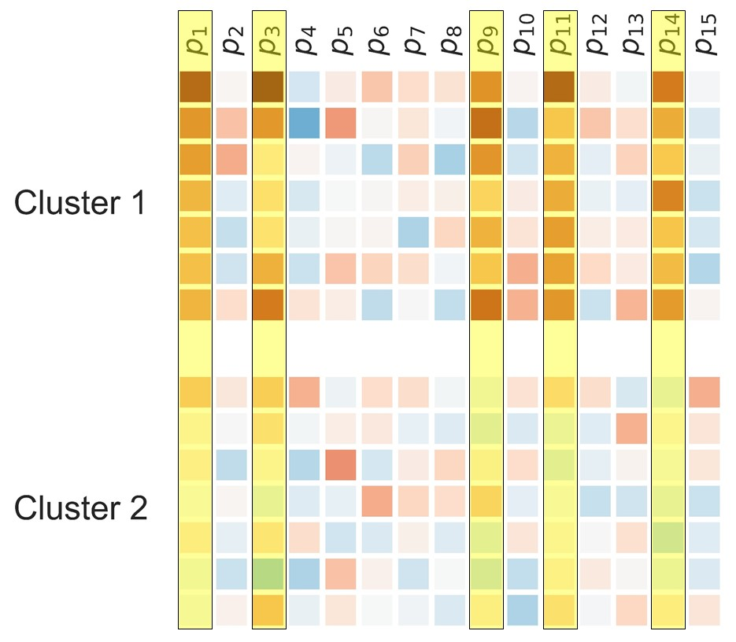

# scPCI
single-cell Post-Clustering Inference

## Abstract
Single-cell RNA-sequencing (scRNA-seq) is useful for uncovering hidden cellular heterogeneity in a cell population. 
In scRNA-seq data analysis, clustering is commonly used for identifying cell groups as clusters, and then cluster-specific genes which are differentially expressed (DE) in one or more clusters are detected. 
Unfortunately, due to the lack of valid statistical method for computing p-values, the latter cluster-specific DE gene detection has been subjectively done by ``eyes'', i.e., based on visualization-tools such as t-SNE.
The intrincic difficulty of the statistical analysis of cluster-specific DE genes is in double-dipping effect; the scRNA-seq data is first used for identifying clusters, and then the same data is used again for detecting cluster-specific DE genes.

We develop a new statistical method called single-cell post-clustering inference (scPCI) that can properly correct the clustering bias by using recent statistical analysis framework called selective inference.
We demonstrate the validity and the usefulness of the scPCI method in controlled simulations studies and re-analyses of published scRNA-seq datasets.
The scPCI method enables the researchers to obtain valid p-values of cluster-specific DE genes, which makes scRNA-seq more quantitative, reliable and reproducible. 

## Environmental Requirement
- Python version 2.7 or 3.6
- Please install required packages when the python "ImportError" occurs

If you want to reproduce the results of real data analysis, you must run preprocessing code written by R.
So you may need following environments.
- R version 3.5
- If some R packages do not exist, please install required R packages.

## Usage
In our study, we re-analyzed two data, [PBMC](https://github.com/10XGenomics/single-cell-3prime-paper)
and [FACS fat](https://github.com/czbiohub/tabula-muris).
Here, we explain the flow of our analysis.

### Preprocessing for real data
Firstly, you do following command.

`create_dir.py`

Then you perform the preprocessing for two dataset.
Preprocessing basically follows the original paper ([PBMC dataset](https://github.com/10XGenomics/single-cell-3prime-paper), [FACS fat](https://github.com/czbiohub/tabula-muris) 
).
In "Preprocessing" directory, you can find the R code for preprocessing.
So you download two dataset in the same directory, according to the original paper.

### 1. Clustering
Perform clustering on preprocessed data.

`python clustering_[dataset name].py`

There are "PBMC" or "FACSfat" in dataset name.

### 2. Post-Clustering Inference
Perform scPCI method. 
You choose scPCI-gene or scPCI-cluster.
If you want to perform scPCI-gene, you should input following command.

`Run_[dataset name].py`

Or if you want to perform scPCI-cluster, you should input following command.

`Run_[dataset name]_gn.py`

### Recalculation of p-value 
In many cases of real data analysis, it is often impossible to calculate p-values numerically.
So we provide the code to approximate these by importance sampling.
We recommend that you do the following after step2.

`Recomp_pval.py` 

`Recomp_pval_gn.py`

## Data format
上の実行結果が, Resultというdirectoryに発生するが, 論文中の図を再現するためには, PCI_[dataset]/each/にPCI-geneの結果を, PCI_[dataset]/global/にPCI-geneの結果を入れる必要がある.

## Lisence
GNU General Public License
